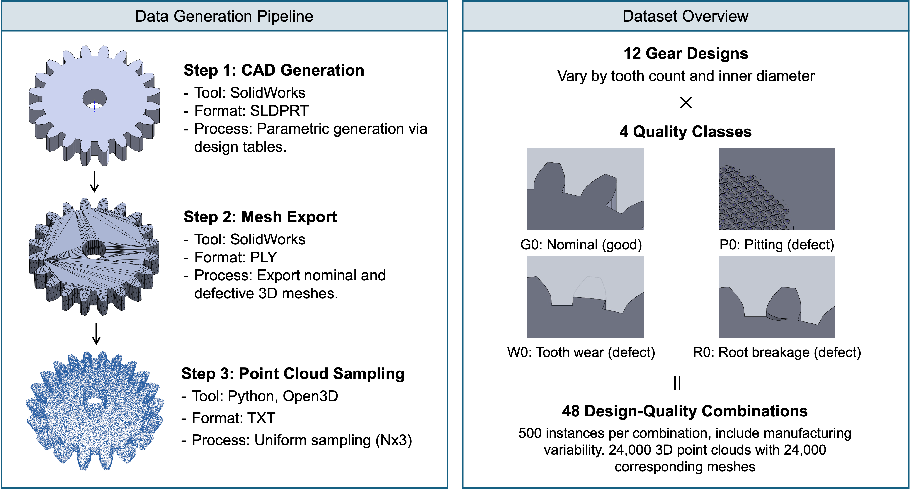

# MFGNet-Gear: A Synthetic 3D Gear Dataset for Manufacturing Quality Inspection
[](https://doi.org/10.7302/qrdj-n812)
[](https://huggingface.co/datasets/rsmei/MFGNet-Gear)
[](https://doi.org/10.1016/j.mfglet.2024.09.159)
[](https://arxiv.org/abs/2607.16288)

**MFGNet-Gear** is a synthetic 3D benchmark dataset for geometric defect detection in gears:
**24,000 parts** spanning **12 gear designs** and **4 quality classes**, each provided in two
paired, ready-to-use representations.

- **Point clouds (`.txt`)** — 100,000 points, unit-sphere–normalized: a standardized,
  scale-invariant input for point-cloud learning, usable as-is.
- **PLY meshes (`.ply`)** — the physical-scale source geometry, in **millimeters**.

## Download

| Location | Contents |
|---|---|
| [Deep Blue Data](https://doi.org/10.7302/qrdj-n812) | Full dataset — all 24,000 parts, both formats (`.ply` and `.txt`) |
| [HuggingFace](https://huggingface.co/datasets/rsmei/MFGNet-Gear) | Mesh files only (`.ply`) — point clouds available on Deep Blue Data |

## Dataset Overview



| Property | Value |
|---|---|
| Total parts | 24,000 |
| Gear designs | 12 (T20–T40 series) |
| Quality classes | 4 (G0, P0, W0, R0) |
| Parts per design-quality class | 500 |
| Points per part | 100,000 |
| Mesh format | `.ply` (polygon mesh) |
| Point cloud format | `.txt` (x,y,z comma-separated) |
| Dataset size | ~11 GB (mesh), ~30 GB (point cloud) |

| Label | Class | Description |
|---|---|---|
| `G0` | Good / nominal | No defect |
| `P0` | Pitting | Surface fatigue damage |
| `W0` | Tooth wear | Material loss due to friction |
| `R0` | Root breakage | Fracture at tooth root |

Gear designs span three tooth counts (20, 30, 40) and four inner diameters each.

## File Naming

All files follow `T{NumberOfTeeth}ID{InnerDiameter}{QualityClass}_{#####}.{ext}`:

```
T20ID10G0_00001.ply   → design T20ID10, good part, index 1, mesh
T20ID10G0_00001.txt   → same part, point cloud
T30ID30R0_00412.txt   → design T30ID30, root breakage, index 412
```

A mesh and its point cloud share the same name, so `.ply` and `.txt` files pair one-to-one.

## Getting Started

The point clouds are ready to use directly. To visualize one:

```bash
pip install -r requirements.txt

python ply2pcd/visualize_pcd.py data/pointcloud_txt/T20ID10G0/T20ID10G0_00001.txt
```

### Physical (millimeter) scale

The `.txt` clouds are normalized to the unit sphere (zero-centered, maximum radius 1) so they
work directly as learning inputs. The paired PLY meshes keep the geometry in **millimeters**,
and you can recover physical scale two ways:

- **Rescale a released cloud** with the per-instance center `c` and scale `s` in
  [`metadata/normalization_params.csv`](metadata/normalization_params.csv): `p_mm = s · p_norm + c`.
- **Resample the mesh** at any point density, in millimeters:

```bash
python ply2pcd/point_sampling.py \
    --input_dir data/mesh_ply --output_dir data/pcd_mm \
    --num_points 500000 --no-normalize
```

Drop `--no-normalize` and use `--num_points 100000` to reproduce the released normalized format.

## Repository Contents

```
mfgnet-gear/
├── cad2ply/       ← SolidWorks master parts, the 48 design tables, and the export macro
├── ply2pcd/       ← point-cloud sampling and visualization scripts
├── metadata/      ← per-instance normalization parameters (mm recovery)
├── validation/    ← quality-validation scripts and reported figures
├── requirements.txt
└── LICENSE
```

## Data Quality

Every released part was checked for completeness and class balance, file integrity, sampling
fidelity, and geometric accuracy against its CAD specification; results are reported in the
*Validation and Quality* section of the paper. The checks are fully scripted in
[`validation/`](validation/) for transparency and reuse.

## Reproducing or Extending the Dataset

The dataset can be regenerated from, or extended beyond, the released CAD sources.

- **Design tables** — [`cad2ply/design_tables/`](cad2ply/design_tables/) contains the 48 finalized
  SolidWorks design tables (one per design-quality class). Each row is one CAD configuration and
  its CAD and applicable defect parameters. These are generation inputs, not measurements sampled
  from the meshes or point clouds.
- **Meshes** — open a master part (e.g. `cad2ply/T20ID10G0.SLDPRT`) in SolidWorks, load the matching
  design table (**Insert → Tables → Excel Design Table → From File**), and run the export macro
  [`cad2ply/saveply251.bas`](cad2ply/saveply251.bas) to save each configuration as PLY. The released
  meshes were exported with SolidWorks 2021 as binary PLY in millimeters, Custom resolution,
  deviation (chord) tolerance 0.0374114 mm, angle tolerance 10°, maximum face size unconstrained.
- **Point clouds** — sample from the meshes with `ply2pcd/point_sampling.py` (see above).

## Citation

If you use MFGNet-Gear, please cite:

```bibtex
@article{mei2024deep,
  title={Deep learning of 3D point clouds for detecting geometric defects in gears},
  author={Mei, Ruo-Syuan and Conway, Christopher H and Bimrose, Miles V and King, William P and Shao, Chenhui},
  journal={Manufacturing Letters},
  volume={41},
  pages={1324--1333},
  year={2024},
  publisher={Elsevier}
}
```

```bibtex
@misc{mei2026synthetic3dgeardataset,
      title={A Synthetic 3D Gear Dataset for Manufacturing Quality Inspection (MFGNet-Gear)},
      author={Ruo-Syuan Mei and Chenhui Shao},
      year={2026},
      eprint={2607.16288},
      archivePrefix={arXiv},
      primaryClass={cs.CV},
      url={https://arxiv.org/abs/2607.16288},
}
```

```bibtex
@misc{mei2026mfgnet,
  author    = {Mei, Ruo-Syuan and Shao, Chenhui},
  title     = {{MFGNet-Gear: A Synthetic 3D Gear Dataset for Manufacturing Quality Inspection}},
  year      = {2026},
  publisher = {University of Michigan - Deep Blue Data},
  type      = {Data set},
  doi       = {10.7302/qrdj-n812},
  url       = {https://doi.org/10.7302/qrdj-n812}
}
```

## License

Code in this repository: MIT License.\
Dataset: Creative Commons Attribution 4.0 (CC BY 4.0).

## Contact

Alice Mei — [github.com/AliceRSMei](https://github.com/AliceRSMei)
